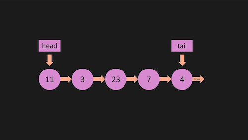
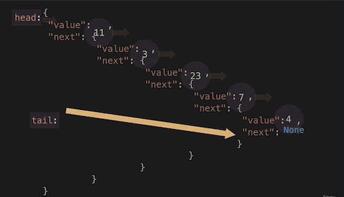

## Linked Lists (Singly)

### Basics
- Whereas an array (for contrast) is a collection of elements (_nodes_) that are contiguous in memory, and which are thus accessible by an index like ```array[1] // 2nd element```, a **linked_list** is a collection of elements that are only _linked_ by a **next** pointer to the next element, no ability to retrieve elements by their index or position exists __aside from starting at the first element each time and then going to next, then to next, etc until the element you want is reached__ 
- Linked lists fundamentally must have a **HEAD** element and **TAIL** element. To mark the beginning and ending nodes
- _Singly_ linked lists indicate only a single direction from node to node (usually forward/next from HEAD) .. A _doubly_ linked list would have bi-directional connections between nodes (which would make something like traversing by starting at TAIL and working backwards more efficient, but involves tradeoffs of it's own, discussed later).
- Efficient operations include **_Inserting_** and **_Deleting_** especially as relates to inserting at the beginning of the List, wheras an array would be required to shift every element/node in a beginning insert.

### Mechanics/Visualization
- The tutorial I'm using by Colt Steele has a number of interesting ways of explaining and kind of visualizing concepts.. A lot of times they look or feel strange at first, but the following is one of them, and I'm including it because it 'lightbulbed' the connection between a different explanation of what linked-lists _look_ like (in a python tutorial also in this repo) and object dot notation. So even though the following code snippet is clearly not the way you'd want to make a linked list.. it **does an excellent job illustrating the _'russian-doll'_ visual of how linked-lists actually do work**
```
// Starting with just a Node class-definition
class Node {
    public val: number
    public next: Node | undefined

    constructor(val: number) {
        this.val = val;
        this.next = null; // Initial node will not have a next node yet
    }
}

// Construct a linked list by 'russian-dolling' the Node objects
const first = new Node(3);
first.next = new Node(5);
first.next.next = new Node(1589);
first.next.next.next = new Node(738);
```
- Notice how we can literally just keep calling the next method to crudely create a linked list in a 'russian-doll' visualization. Below are images from Scott Barrett's python algos tutorial which better show this concept of linked lists

 
